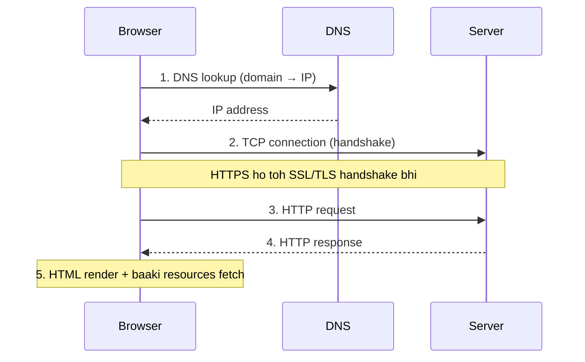

# What happens when you type a URL into your browser?

Date: 05 Sep 2026

> **Video:** [What happens when you type a URL into your browser? (ByteByteGo)](https://www.youtube.com/watch?v=AlkDbnbv7dk)

## URL kya hota hai?

**URL** = Uniform Resource Locator. Iske 4 parts hote hain:

| Part | Example | Matlab |
|------|---------|--------|
| **Scheme** | `http://` | Browser ko batata hai kaunsa protocol use karna hai. `https://` me connection **encrypted** hota hai. |
| **Domain** | `example.com` | Site ka domain name. |
| **Path** | `/products/` | Server pe directory jaisa samjho. |
| **Resource** | `phone.html` | File jaisa samjho. |

- Path + resource ka difference aksar clear nahi hota — simple funda: regular file system ke **directory aur file** jaise hain. Dono milke batate hain ki server se kaunsa resource load karna hai.

## Overall Flow

## Step 1: DNS Lookup

- **DNS (Domain Name System)** = internet ki **phone book**. Domain name ko **IP address** me translate karta hai, taaki browser server tak pahunch sake.
- Lookup fast rakhne ke liye DNS info **heavily cached** hoti hai — har level pe:
  1. **Browser cache** — browser khud thodi der ke liye answer cache karta hai.
  2. **OS cache** — browser cache me nahi mila toh operating system se poochta hai, OS bhi short period ke liye cache rakhta hai.
  3. **DNS resolver** — OS ke paas bhi nahi hai toh internet pe DNS resolver ko query jaati hai. Ye ek chain of requests trigger karta hai jab tak IP resolve nahi ho jata.
- Is process me DNS infrastructure ke **kai servers** involve hote hain, aur **har step pe answer cache** hota hai.

## Step 2: TCP Connection

- IP address milne ke baad browser server se **TCP connection** establish karta hai.
- TCP connection banane me **handshake** hota hai — isme **kai network round trips** lagte hain (yaani costly hai).
- Isliye modern browsers **keep-alive connection** use karte hain — ek bana hua TCP connection ko baar-baar **reuse** karte hain, taaki page loading fast rahe.

### HTTPS ho toh extra kaam

- HTTPS me new connection banana aur bhi **mehenga** hai — **SSL/TLS handshake** karna padta hai jo browser aur server ke beech encrypted connection banata hai.
- Ye handshake expensive hai, isliye browsers **SSL session resumption** jaisi tricks use karte hain cost kam karne ke liye (purana session dobara use kar lo, full handshake mat karo).

## Step 3-4: HTTP Request & Response

- Established TCP connection ke upar browser **HTTP request** bhejta hai.
- HTTP apne aap me ek **simple protocol** hai.
- Server request process karke **response** wapas bhejta hai.

## Step 5: Rendering & Additional Resources

- Browser response receive karke **HTML content render** karta hai.
- Page me aksar aur resources hote hain — **JavaScript bundles, images** etc.
- In sabke liye browser **same process repeat** karta hai: DNS lookup → TCP connection → HTTP request.

## Key Takeaways

- URL ke 4 parts: **scheme, domain, path, resource**.
- **DNS = phone book of internet**; speed ke liye har layer (browser → OS → resolver) pe caching.
- **TCP handshake costly** hai → keep-alive se connection reuse.
- **TLS handshake aur bhi costly** → SSL session resumption se optimize.
- Ek page load = ye poora cycle **har resource ke liye repeat** hota hai.

> **Interview tip:** Ye classic interview question hai. Answer ka structure yaad rakho — URL parsing → DNS lookup (caching layers ke saath) → TCP (+TLS) handshake → HTTP request/response → render + repeat for resources. Har step pe "kaise fast banate hain" (caching, keep-alive, session resumption) mention karna strong answer banata hai.
